# F.palace

## 📜 Лицензия
Этот проект распространяется под лицензией **MIT**.  
Подробнее см. [LICENSE](LICENSE).

**Описание проекта**: House — это сайт ресторана с модальными окнами, регистрацией(авторизацией) и fsd архитектурой, он написан на NextJS(TypeScript), NestJS и Scss.
[](https://opensource.org/licenses/MIT)
[](https://nextjs.org/)
[](https://nestjs.com)

### Функционал

- Адаптивный дизайн
- Анимации при наведении, фокусировании и нажатии
- Анимированный header
- Регистрация
- Авторизация
- JWT
- Модальные окна
- Валидация данных
- Автоматическая прокрутка
- Бизнес логика

### Технологии
- **Frontend**: React 18, TypeScript, Zustand, React Router 6, React Query, Axios, Vite, SCSS, SVGR.
  [](https://nextjs.org/) 
  [](https://www.typescriptlang.org/)  
  [](https://github.com/pmndrs/zustand) 
  [](https://tanstack.com/query/latest/)  
  [](https://github.com/colinhacks/zod)
  [](https://react-hook-form.com/)
  [](https://axios-http.com/)   
  [](https://sass-lang.com/)  
  [](https://react-svgr.com/)  
  [](https://feature-sliced.design/)
- **Backend**: Express, MySQL, TypeORM.
   [](https://nestjs.com/)  
  [](https://www.postgresql.org/)  
  [](https://typeorm.io/)   
- **Дизайн**: Figma.
  [](https://figma.com/)

### Установка

1. Клонирование репозитория:

   ```bash
   https://github.com/BlackDarkes/F.palace.git

   ```

2. Запустите проект:
   
    Node.js >= 18.x
    npm >= 9.x
   ```bash
   cd api && npm install && npm start
   cd frontend && npm install && npm run dev
   ```

### Пример кода

1. React

```TypeScript
"use client"

import { SubmitHandler, useForm } from "react-hook-form";
import { zodResolver } from "@hookform/resolvers/zod";
import z from "zod";
import { useLogin } from "../../api/useLogin";
import { ILogin } from "../../model/types/login.interface";
import { useStore } from "@/app/store/store";
import { Button } from "@/shared/ui";
import styles from "./LoginForm.module.scss";

const loginSchema = z.object({
  email: z
    .email("Некорректный формат email")
    .min(1, "Email не может быть пустым"),
  password: z.string().min(6, "Пароль должен содержать минимум 6 символов"),
});

export const LoginForm = () => {
  const {
    register,
    reset,
    formState: { errors },
    handleSubmit,
  } = useForm({
    resolver: zodResolver(loginSchema),
  });

  const { handleModelFormOpen, handleType } = useStore();

  const { mutate } = useLogin();

  const onSubmit: SubmitHandler<ILogin> = (data) => {
    mutate(data);
    reset();
    handleModelFormOpen();
  };

  return (
    <div className={styles.login}>
      <h2 className={styles.loginTitle}>Login</h2>

      <form action="" method="post" onSubmit={handleSubmit(onSubmit)}>
        <div className={styles.loginInputs}>
          <p>
            <input
              type="email"
              className={styles.loginInput}
              {...register("email")}
              placeholder="email..."
            />
            {errors.email && (
              <span className={styles.loginError}>{errors.email?.message}</span>
            )}
          </p>
          <p>
            <input
              type="password"
              className={styles.loginInput}
              {...register("password")}
              placeholder="password..."
            />
            {errors.password && (
              <span className={styles.loginError}>
                {errors.password?.message}
              </span>
            )}
          </p>
        </div>

        <div className={styles.loginButtons}>
          <button type="button"  className={styles.loginLink} onClick={() => handleType("register")}>
            To register
          </button>

          <Button>Login</Button>
        </div>
      </form>
    </div>
  );
};
```
2. NestJs
```TypeScript
import { Injectable } from '@nestjs/common';
import { Repository } from 'typeorm';
import { UsersEntity } from './entities/user.entity';
import { InjectRepository } from '@nestjs/typeorm';

@Injectable()
export class UserService {
  constructor(
    @InjectRepository(UsersEntity)
    private readonly userRepository: Repository<UsersEntity>,
  ) {}

  async getByEmail(email: string): Promise<UsersEntity | null> {
    return this.userRepository.findOne({ where: { email } })
  }

  async getById(id: string): Promise<UsersEntity | null> {
    return this.userRepository.findOne({ where: { id } });
  }

  async create(user: Partial<UsersEntity>) {
    const newUser = this.userRepository.create(user);
    const saveUser = this.userRepository.save(newUser);

    return saveUser;
  }
}

```

### Структура проекта:
    project/  
    ├── frontend/       
    ├── api/        
    └── README.md  

## Изображения проекта:
1. **Desktop изображения:**
  
  *Рис. 1: Главная страница сайта в десктопной версии.* 

  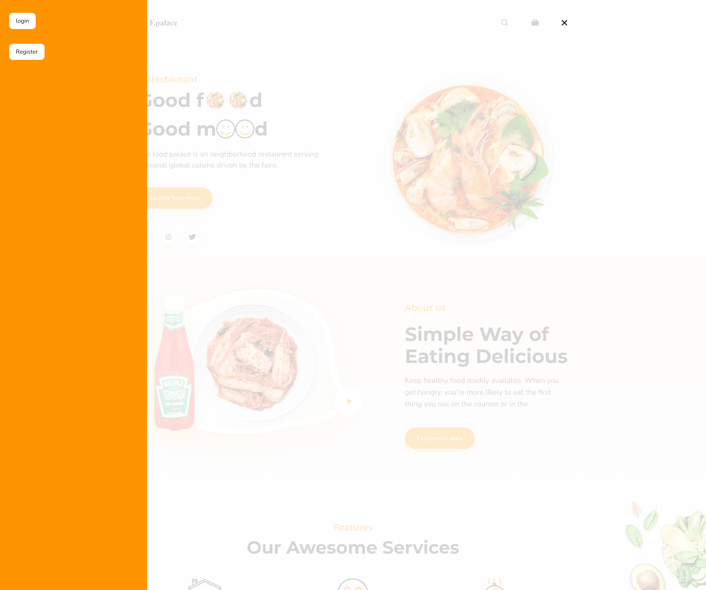
  *Рис. 2: Бургер меню в десктопной версии.* 

  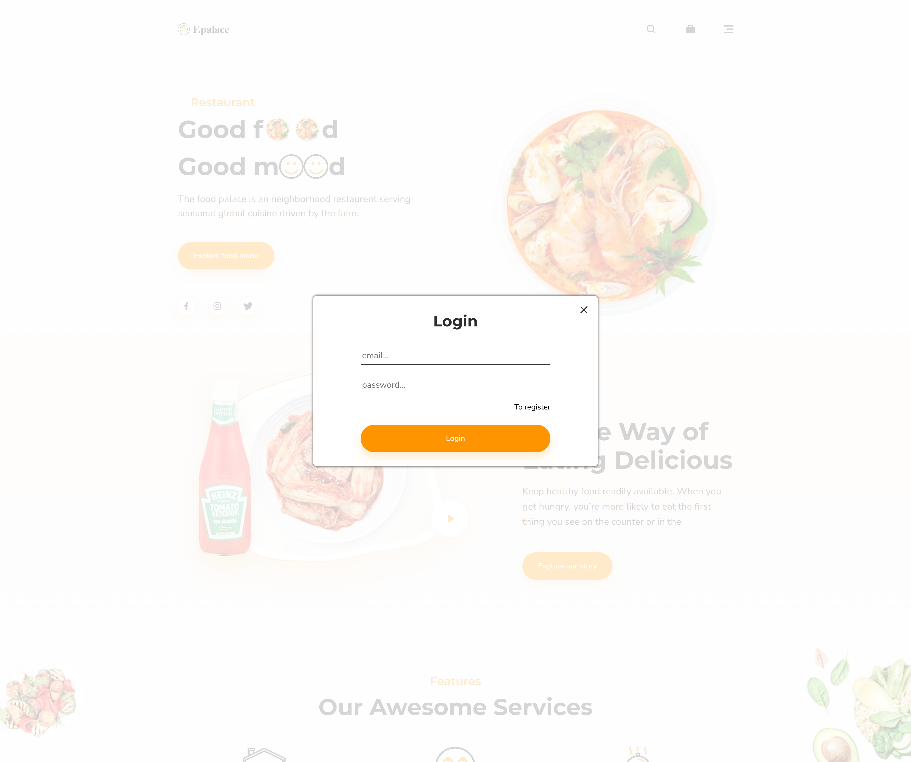
  *Рис. 3: Форма авторизации.*

  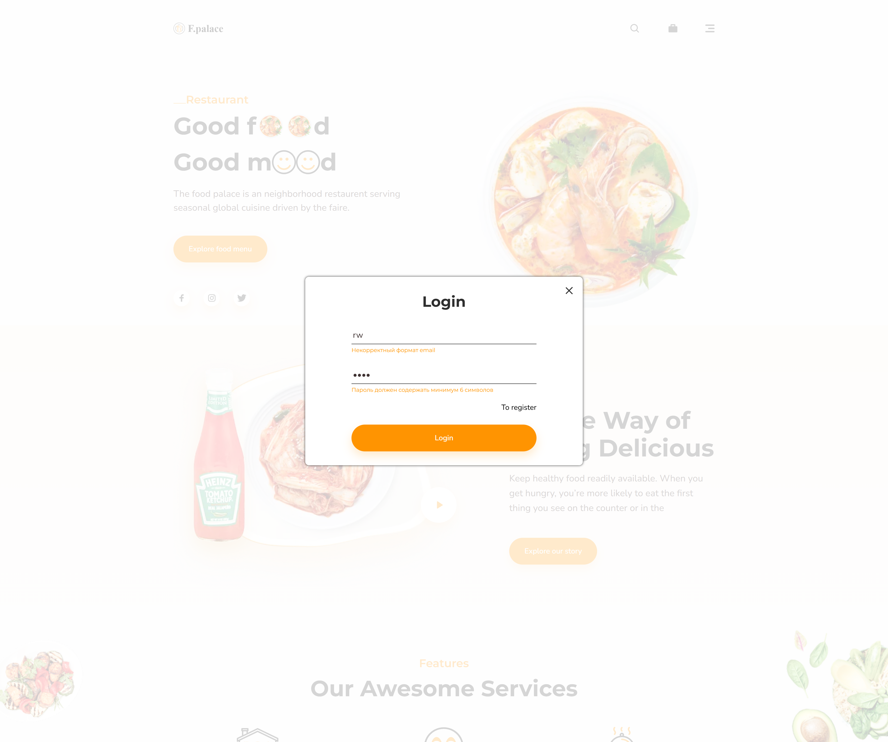
  *Рис. 4: Валидация формы.*

  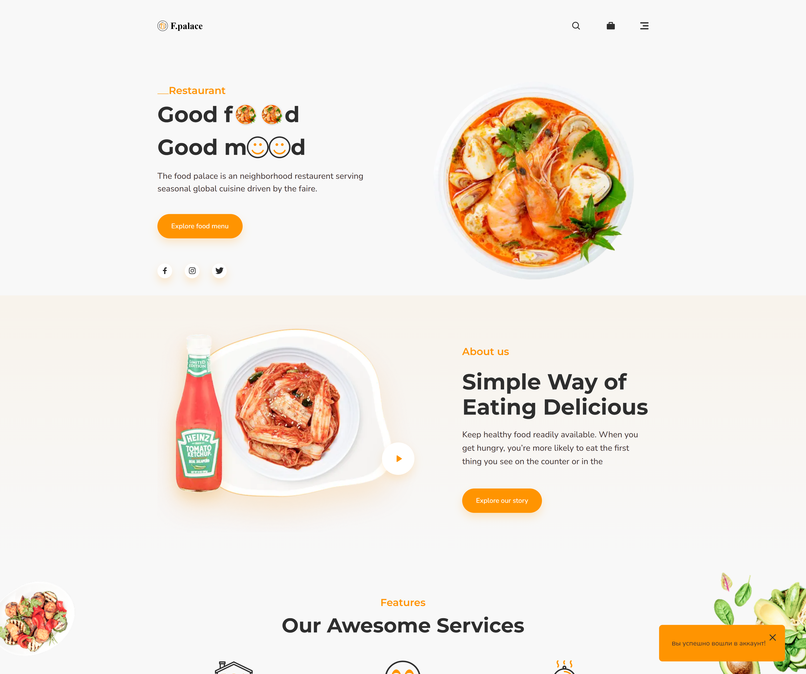
  *Рис. 5: Toast сообщение.*

  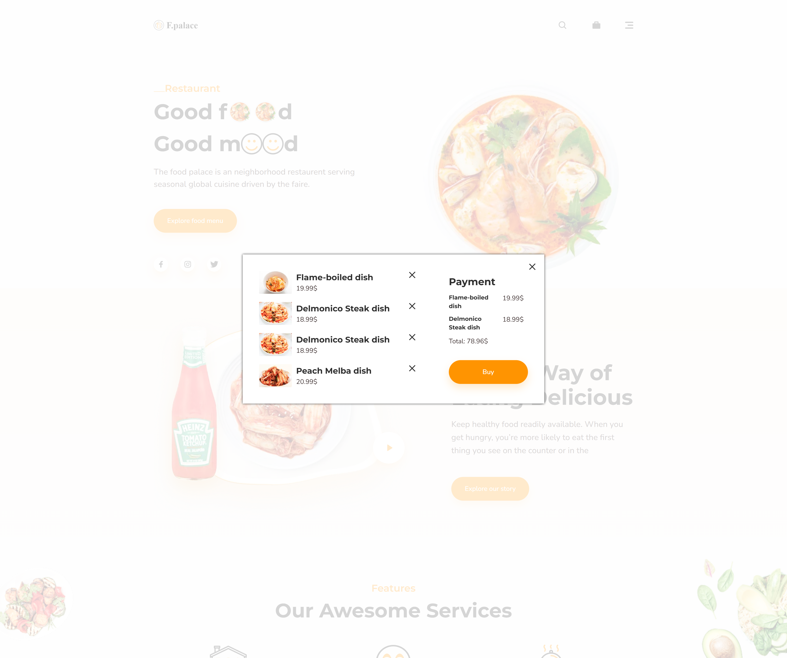
  *Рис. 6: Корзина.*

  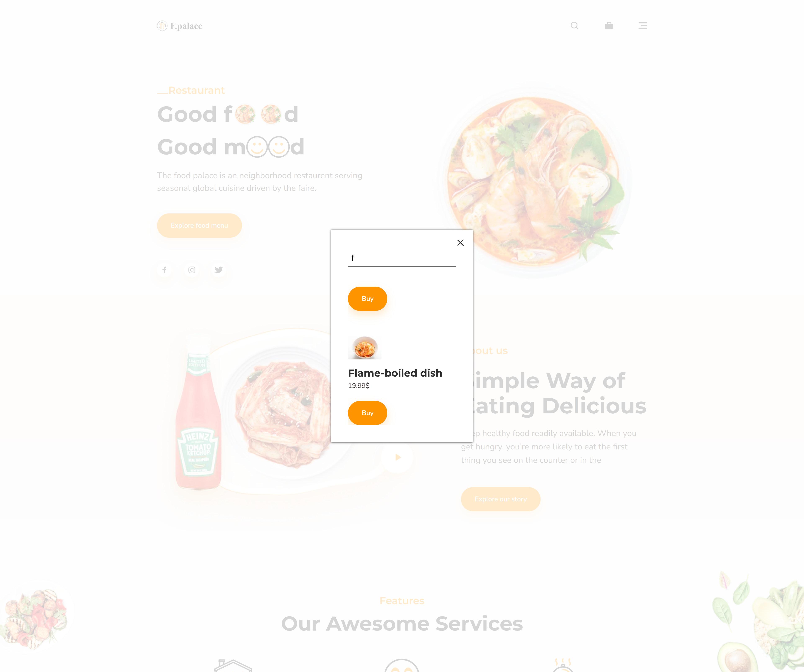
  *Рис. 7: Поиск.*


1. **Mobile изображения:**
   
   

   *Рис. 8: Главная страница сайта в мобильной версии.*
   
   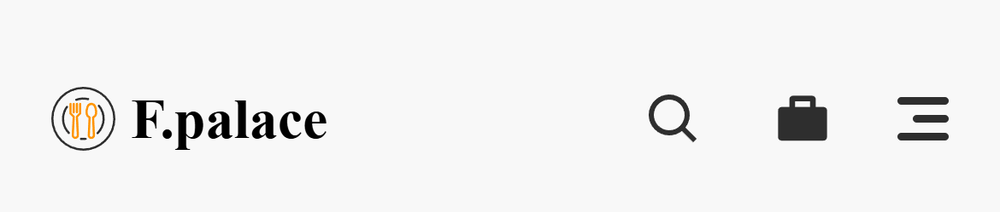

   *Рис. 9: Header в мобильной версии.*
   
   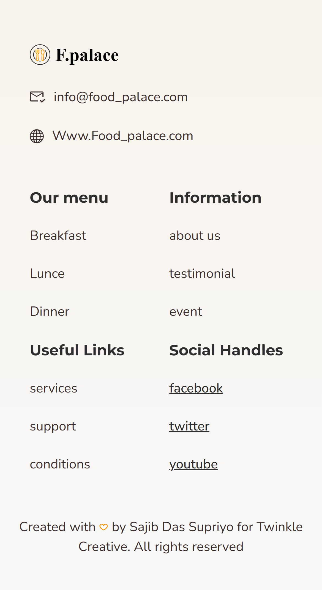

   *Рис. 10: Footer в мобильной версии.*

   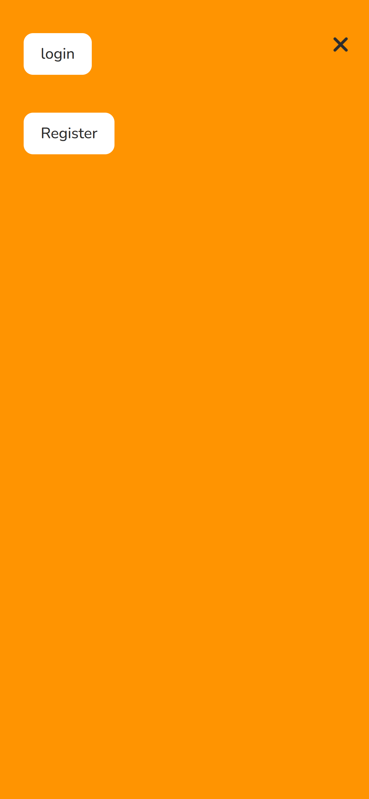

   *Рис. 11: Бургер меню в мобильной версии.*

   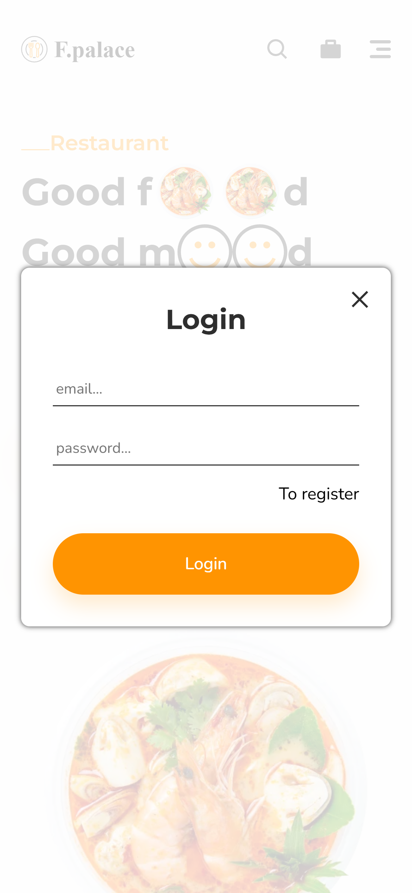

   *Рис. 12: Форма авторизации в мобильной версии.*

   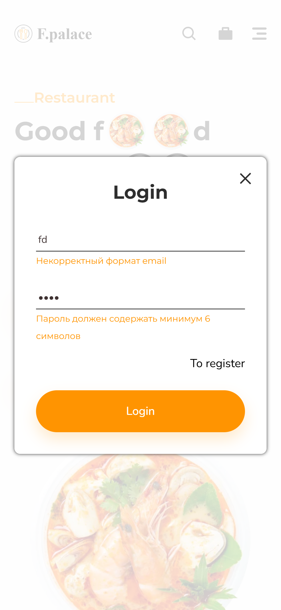

   *Рис. 13: Форма авторизации с валидацией.*

   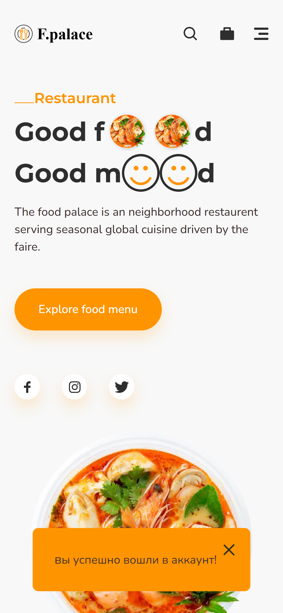

   *Рис. 14: Toast сообщение от успешной авторизацией в мобильной версии.*

   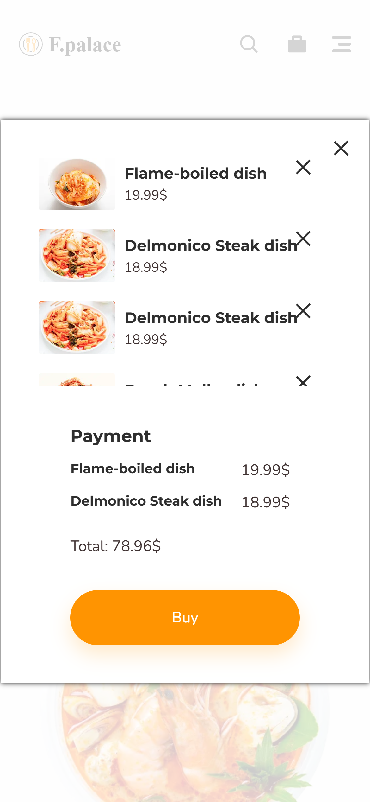

   *Рис. 15: Cart в мобильной версии.*

   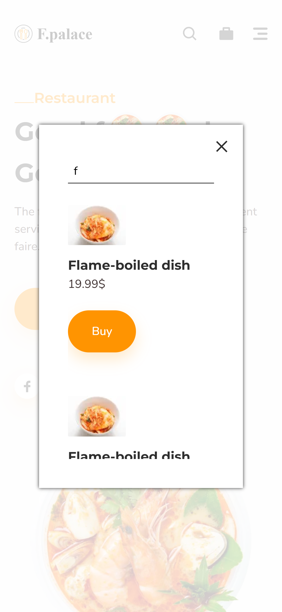

   *Рис. 16: Search в мобильной версии.*